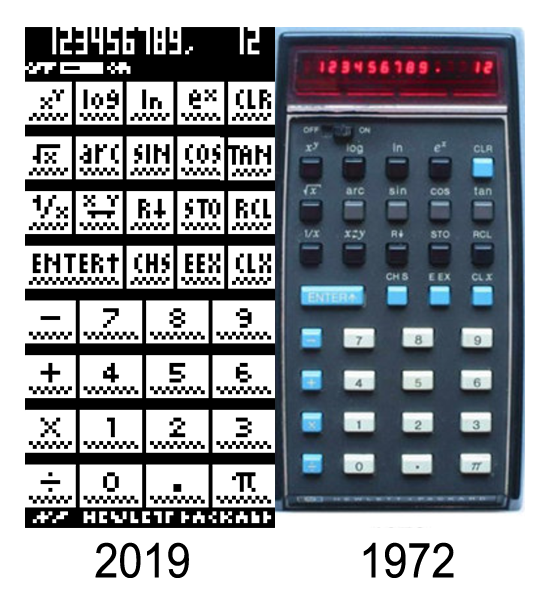

# HP35boy

HP35boy is a HP35 Emulator for Arduboy. The HP-35 was Hewlett-Packard's first pocket calculator and the world's first scientific pocket calculator: a calculator with trigonometric and exponential functions. https://en.wikipedia.org/wiki/HP-35

## Install on your Arduboy
Check http://arduboy.ried.cl 

## Credits

The whole emulator was written by http://home.citycable.ch/pierrefleur/Jacques-Laporte/HP35_Arduino.htm, this is merely an adaptation for the Arduboy form factor. Please check `rom.h` credits for the original license text

## ROM with bug

To use an alternative version of the ROM with the `exp(ln(2.02))=2` bug, hold button B when booting. http://www.jacques-laporte.org/HP3520bug.htm
